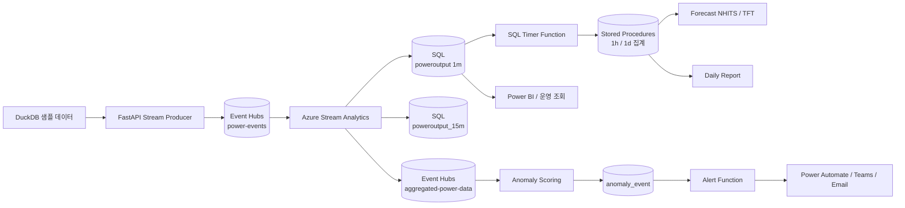

# Smart Factory Electricity Control System

스마트 팩토리 설비에서 5초 단위로 수집되는 전력 이벤트를 운영 가능한 시간 단위로 집계하고, 전력 품질 이상·설비 이상·수요 예측·리포트·알림을 연결하는 데이터 플랫폼입니다.

현재 구현의 운영 결과는 설비 자동 제어 명령이 아니라 분석 결과, 리포트, 운영 알림입니다. 제어 시스템 연동은 운영 정책과 승인 절차가 정해진 뒤 별도 인터페이스로 연결할 수 있습니다.

## 전체 흐름



핵심 경계는 다음과 같습니다.

- `FastAPI`는 원천 전력 이벤트를 스트림으로 전송합니다.
- `Stream Analytics`는 1분·15분 운영 집계와 ML 입력 이벤트를 만듭니다.
- `SQL Timer Function`은 저장 프로시저를 호출해 1시간·1일 집계를 생성합니다.
- `ml_package`는 규칙/IQR와 Isolation Forest 기반 이상 점수를 계산합니다.
- `mlforecast`는 집계 전력 데이터를 바탕으로 수요를 예측합니다.
- `functions`와 `power-anomaly-alert-function`은 리포트와 운영 알림을 담당합니다.

## 서비스 구성

| 영역 | 경로 | 책임 |
| --- | --- | --- |
| 스트림 생산 | `fastapi/` | 샘플 전력 이벤트 생성, 전송 상태·헬스 확인 |
| 1시간·1일 집계 | `fastapi/sql-timer-trigger/` | SQL 저장 프로시저 호출 |
| 이상 탐지 | `ml_package/` | 특징량 검증, 규칙/IQR, Isolation Forest, 등급화 |
| 수요 예측 | `mlforecast/` | NHITS/TFT 추론 및 예측 결과 저장 |
| 일일 리포트 | `functions/` | 운영용 전력 분석 리포트 생성 |
| 이상 알림 | `power-anomaly-alert-function/` | `anomaly_event`의 대기 이벤트를 외부 알림으로 전달 |
| 인프라 | `infra/` | Azure 리소스와 Stream Analytics 쿼리의 Bicep 정의 |

## 집계 책임

| 시간 단위 | 생성 위치 | 용도 |
| --- | --- | --- |
| 1분 | Stream Analytics → `poweroutput` | 운영 대시보드, 기본 이상 탐지 |
| 15분 | Stream Analytics → `poweroutput_15m` | 단기 추세와 ML 입력 전처리 |
| 1시간 | SQL 저장 프로시저 `usp_timer_aggregate_1h` | 시간별 운영 분석 |
| 1일 | SQL 저장 프로시저 `usp_timer_aggregate_1d` | 일일 리포트와 장기 추세 |

세부 스키마와 중복 방지 기준은 [docs/data-pipeline.md](docs/data-pipeline.md)에 정리했습니다.

## 저장소 구조

```text
.
├── fastapi/                         # 스트림 생산 API와 SQL Timer Function
├── functions/                       # 일일 리포트 Function
├── mlforecast/                      # NHITS/TFT 수요 예측
├── ml_package/                      # 이상 탐지·스코어링 패키지
├── power-anomaly-alert-function/    # Teams/Power Automate 알림
├── infra/                            # Azure Bicep, Stream Analytics query
├── docs/
│   ├── architecture.md              # 서비스 경계와 런타임 흐름
│   ├── data-pipeline.md             # 집계·테이블·이벤트 계약
│   └── operations.md                # 로컬 실행·배포·장애 대응
├── .github/workflows/                # IaC 검증·what-if·dev 배포
├── CONTRIBUTING.md                   # 변경·커밋·PR 규칙
└── security-audit.md                 # 공개 저장소 보안 점검 기록
```

## 로컬 실행

FastAPI 스트림 생산기는 `fastapi/`에서 실행합니다.

```bash
cd fastapi
python -m venv .venv
source .venv/bin/activate
pip install -r requirements.txt
cp .env.template .env
uvicorn app.main:app --reload
```

주요 엔드포인트는 다음과 같습니다.

- `GET /health` — 애플리케이션 상태
- `GET /api/stream/sample` — 샘플 이벤트 확인
- `POST /api/stream/start` — 스트림 전송 시작
- `POST /api/stream/stop` — 스트림 전송 중지
- `GET /api/stream/status` — 전송 상태 확인

이상 탐지는 공개 저장소에 포함하지 않은 학습 임계값 파일을 주입한 뒤 실행해야 합니다. 임계값 통계 파일의 위치와 보안 기준은 [security-audit.md](security-audit.md)를 참고하세요.

## IaC와 배포

`infra/`는 다음 리소스를 Bicep으로 관리합니다.

- Storage Account, Event Hubs Namespace와 Hub
- Stream Analytics Job
- SQL Server/Database 연결 설정
- Function Apps와 Application Insights
- Key Vault 및 운영 설정의 기본 구조

권장 순서는 `Bicep build` → GitHub Actions `what-if` → dev 배포 → Azure 리소스 확인 → 애플리케이션 배포입니다. 상세 절차는 [docs/operations.md](docs/operations.md), 모듈 설명은 [infra/README.md](infra/README.md)에 있습니다.

현재 GitHub Actions에는 IaC 검증, 수동 what-if, dev 배포 workflow가 반영되어 있습니다. 운영 배포와 애플리케이션 artifact 배포는 환경별 승인 정책을 정한 뒤 연결하는 범위입니다.

## 보안 원칙

공개 저장소에는 다음을 포함하지 않습니다.

- 실제 SQL 비밀번호, 연결 문자열, Event Hubs 키, Teams webhook
- `*.env`, `local.settings.json`
- `*.joblib`, DuckDB, CSV/Parquet 데이터
- 설비별 학습 통계와 운영 임계값 원본

배포 시 비밀값은 GitHub Actions OIDC, Azure Key Vault 또는 Function App 설정으로 주입합니다. 템플릿은 키 이름과 필요한 형식만 제공합니다. 상세 점검 결과는 [security-audit.md](security-audit.md)에 기록합니다.

## 문서 안내

- [아키텍처](docs/architecture.md)
- [데이터 파이프라인과 집계 기준](docs/data-pipeline.md)
- [운영·배포·장애 대응](docs/operations.md)
- [기여·커밋·PR 규칙](CONTRIBUTING.md)
- [보안 점검 기록](security-audit.md)

## 현재 범위

현재 저장소는 전력 이벤트 수집, 시간 단위 집계, 이상 분석, 수요 예측, 리포트, 운영 알림, Azure 인프라 정의를 포함합니다. 설비에 제어 명령을 자동으로 보내는 기능은 운영 정책·승인·롤백 계약이 확정된 이후 별도 범위로 추가합니다.
